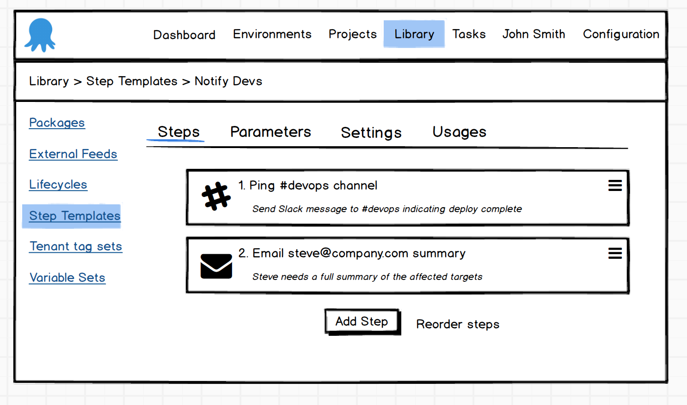
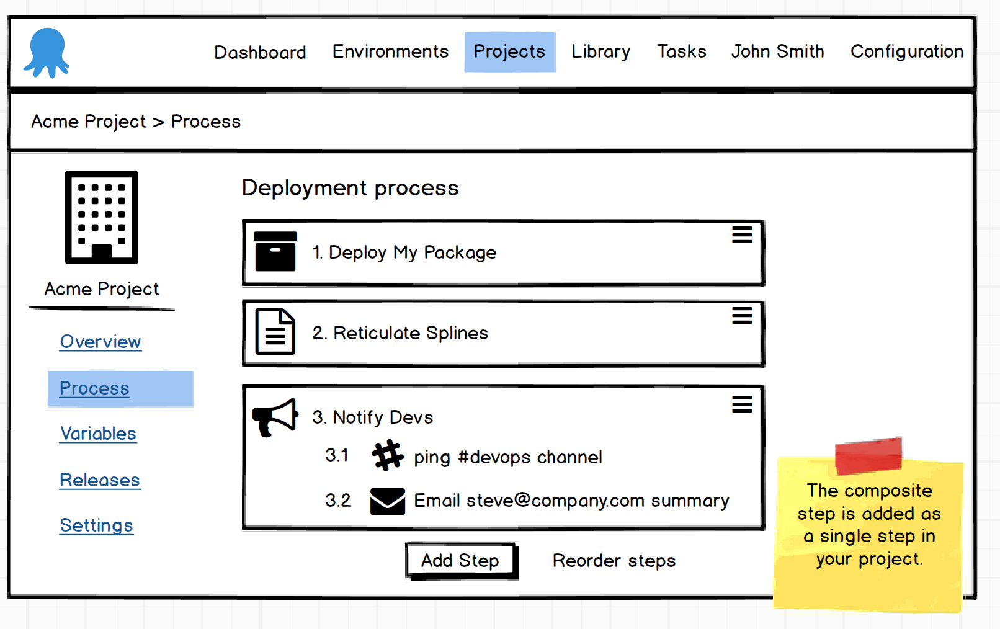

# Compositte Step Templates #

## User Requests ##
[UserVoice #12948603 - Composite Step Templates (686 votes)](https://octopusdeploy.uservoice.com/forums/170787-general/suggestions/12948603-composite-step-templates)

[UserVoice #6559846- Inheritable Step Templates (179 votes)](https://octopusdeploy.uservoice.com/forums/170787-general/suggestions/6559846-inheritable-templates)

[UserVoice #6939372 - Blue/Green Deployments (145 votes)](https://octopusdeploy.uservoice.com/forums/170787-general/suggestions/6939372-make-the-blue-green-model-the-gold-standard-of-dep)

[UserVoice #6512944 - Blue/Green Deployments (6 votes)](https://octopusdeploy.uservoice.com/forums/170787-general/suggestions/6512944-what-happened-to-blue-green-deployment)

## Design ##
#### Set Up ####
A user should be able to create a composite step template in a similar manner to existing "single" step templates with the difference that rather than adding a single script, a set of other steps are added creating its own process.

A composite step template would still be able to provide parameters just like any other standard step template. These parameters will be made available to all of its constituent steps.

#### Usage ####
When a composite step template is added to a project, the template parameter values can be supplied in a way similar to existing templates. The steps can be targeted to specific roles (where appropriate) and the same sort of execution conditions can be applied.

There are a couple different ways that inner actions could be managed within a project. 

We could consider a composite step added into a project as a single indivisible unit. The inner actions would be un-editable (unless done through the original template in the library which would be reflected through all usages), non-rearrangable and no additional custom actions would be able to be interspersed between them. This has the benefit of being easy for to flow down updates if the original template is changed however come at the cost of flexibility.

Alternatively we could allow adding additional actions which would require ensuring that the "template actions" are non-editable so that when changes are made to the template we can accurately determine where changes need to be made.

Finally we could also take the approach that once a composite step template is added to a project, the constituent steps are just dumped into the project deployment process, disconnected from the original template and treated from there like any other step.

The first approach is probably the simplest approach for a first phase and should meet most of the goals of the user requirements. 

### Deployment Patterns ###
Common deployment patterns could be interpreted as built-in composite step templates with a bit of a wizard to fill in some of the key step types.
Although the following depicts mockups using resources, which may or may not be available at the time of this work, it serves as an example. As such, feel free to ignore some of the finer details.

The user us provided with a set of deployment patterns when adding a new step.

In this blue/green deployment scenario the user has specified that the deployment resource is an IIS web server. From this selection then, there are two different ways they may want to handle running multiple instances of this website. Either by running the same bindings across multiple targets, or buy using one machine but just exposing the blue and green website, say with different ports. In the first case the determination of which machine is blue and which is green needs to take place outside of the deployment window, but not when it is shared on a single machine.

In the next step of the wizard the user has to select which resource will play the role of load balancer in this deployment. Depending on which load balancer they select, e.g. NGinX, Azure etc, then different step types will be utilized during the load balancer phases.

At the end the selected options determine a bunch of steps that are added to the project.

At this point the steps are treated like any other composite step template and the steps can be modified as desired.

_Mockups available in [CompositeStepTemplates.bmpr](./CompositeStepTemplates.bmpr)_