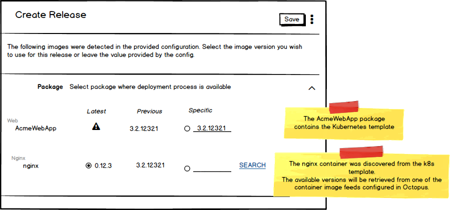
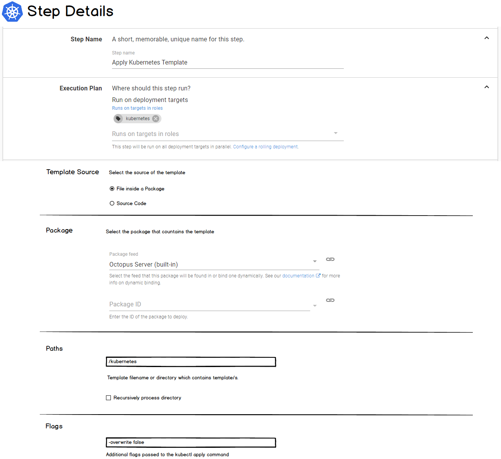

# Kubernetes

Support for Kubernetes in Octopus Deploy will take the form of:

- New Step (Kubernetes Apply) 
- New Target (Kubernetes Cluster)

## Kubernetes Apply Step

Kubernetes supports both [declarative and imperative modes of object management](https://kubernetes.io/docs/concepts/overview/object-management-kubectl/overview/#management-techniques).  

For Octopus, it seems a natural fit to support the declarative approach. This is implemented via the [kubectl apply command](https://kubernetes.io/docs/reference/generated/kubectl/kubectl-commands#apply). We will expose this via a dedicated step. 

The imperative approaches make less sense to implement via Octopus. We can always roll these out in subsequent phases if there is demand. For any of the imperative commands which do not specify container images (e.g. `kubectl delete`), these are relatively simply to implement in Octopus as custom script steps.

The `kubectl apply` command accepts templates (in either JSON or YAML). We will allow these templates to be either contained in a package (surely the more common scenario), or configured directly as source. 

### Container Image Replacement

The K8 templates specify container images. For example, the template below specifies version 1.7.9 of the nginx image.

```
apiVersion: apps/v1beta1
kind: Deployment
metadata:
  name: nginx-deployment
spec:
  minReadySeconds: 5
  template:
    metadata:
      labels:
        app: nginx
    spec:
      containers:
      - name: nginx
        image: nginx:1.7.9
        ports:
        - containerPort: 80
```

When creating a release of a project which contains Kubernetes Apply steps, we will potentially perform a two-step process:

First we fetch the package which contains the template (assuming it is sourced from an external template)
 
Second, we parse the retrieved template yaml file and locate any container image references. Since there is unlikely to be a simple way to determine _which_ feed contains the image listed in the configuration, Octopus will perform a lookup across all configured Octopus Docker feeds (unlikely to be more than a couple right?) for that image. The user will then be presented with the ability to select versions to override values specified in the config. Optionally if Octopus cannot locate the package then they will be presented with a message that no image could be found and so no Octopus overrides will take place.



It will not be necessary to supply versions for all container images specified in the template.  Any which do not have values supplied will simply not be replaced, and will use the version specified in the template.

If the release is created via the API, then the versions of the container images will be passed just as regular package versions are supplied when creating a release.

At deployment time, we will take any specified container image versions and substitute them into the template, before it is passed to the `kubectl apply` command.

### Impact on Octopus: multiple packages per action

One big side effect of this feature for Octopus deploy, will be the requirement to support multiple packages for a single action. At the moment any steps that require a package contain the information under `Octopus.Action.Package.PackageId`, with this change the suggested approach would be to index the package details under the name specified by the image in the configuration. In the example above, this might look like `Octopus.Action.Package[Nginx].PackageId`, `Octopus.Action.Package[Nginx].FeedId` etc. This will require changes to Octopus Server and Calamari.

### Variable Substitution

General Octopus variable-substitution will be applied to the template.



### Output

The output from the `kubectl apply` command will be captured as an output variable.

The output format can be specified (see the `output` flag of the [kubectl apply cmd](https://kubernetes.io/docs/reference/generated/kubectl/kubectl-commands#apply)). One of the options is JSON (which can be further customized using the `jsonpath` option). Using the JSON properties functionality which is available in Octostache, this should be useful.

## Kubernetes Cluster Target

We will create a new target type, _Kubernetes Cluster_, to represent the cluster the Kubernetes Apply step will execute against. 

Conceptually this target is a URL and credentials for authentication.

We will support the authentication methods:

- Username + Password
- Certificate
- API Token


