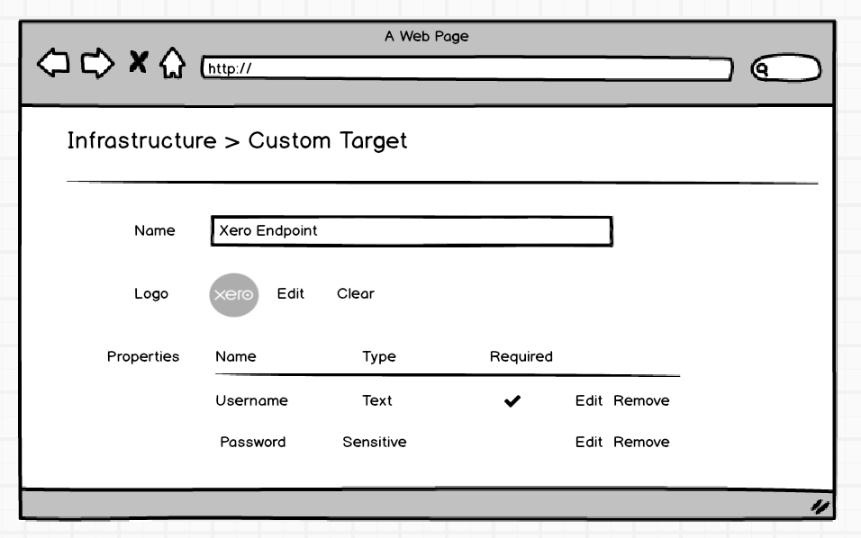
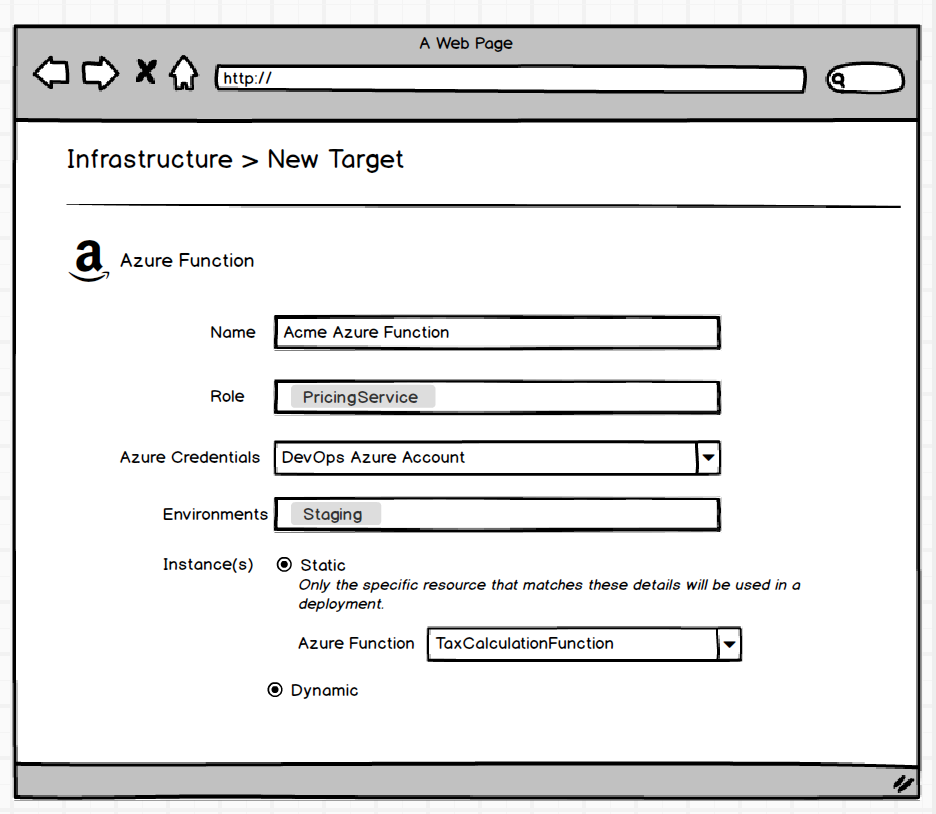

# Resources #
## To be renamed just "Targets" (Dynamic and Custom)

#### One Liner
It's `3.0` version of Azure Targets but made to behave more like cattle by adding a dash of Cloud Regions.

#### Expanded Summary
_Disclaimer: Externally to users there are **now just `Targets`** (no resources). The terminology of the different types described here are just for internal discussion purposes to differentiate how they work. Don't get too caught up in terminology just yet._

`Custom Targets` can be defined, which specify properties (potentially `Typed Variables`) and icons and are used during deployments, typically for steps which require those properties for execution (e.g. a `Xero Target` may require a HTTP endpoint and some credentials and it used specifically by a `Xero Report` step). Think `Cloud Regions` but less generic and able to be user defined. Similar to a `Cloud Region`, a custom target by definition runs on the server (or worker) and can be iterated over if multiple exist in that environment.

A `Dynamic Target` is effectively a `Custom Target` that contains a rules that are used to derive the concrete instances. These instances are resolved through the appropriate `Target Provider` (e.g. Azure Target Provider uses target rules from Azure-defined Cloud Target) at runtime. In "Pet" mode the `Cloud Azure Target` can function like standard Custom Targets, where the specific azure resource can be selected via the UI rather than with rules. When these `Dynamic Targets` are resolved, they may resolve to multiple concrete instances (e.g. a rule on an Azure Cloud Service Target that includes all Cloud Services with the Azure Tag `BankingService`).

To Summarize:
* Externally users just think of targets as being the "Target of change of the action".
* **Machine Targets:** 
    * Run on some Octopus managed external location (Tentacle, SSH, Offline)
* **Custom Targets:** 
    * Run on the Worker. 
    * Just a bundle of properties which can be user defined. 
    * Can be iterated over in a deployment (much like Cloud Regions) and expose a higher level abstraction.
* **Dynamic Targets:** 
    * _Typically_ Run on the Worker (unless maybe they can also resolve through Octopus Target Provider into Tentacles?)
    * At runtime a Target Provider is consulted to determine the target details. 
    * This could be many or none.
    * User can optionally use rules or static configuration.

_Custom Target_

_Dynamic Target_

