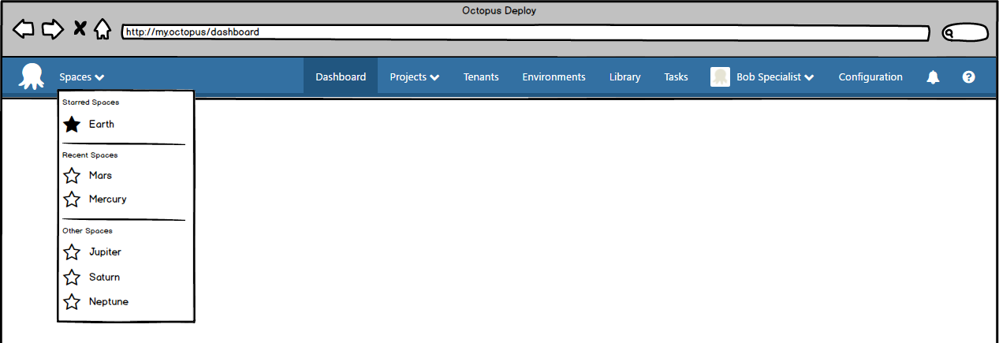

# Spaces

## The Problem

Octopus was original designed with small teams in mind. Everything is at the global level: Projects, Environments, Lifecycles, Variable-Sets, etc.

In large organizations, as more teams onboard, this doesn't scale well:

- People end up "namespacing" things to avoid conflicts and confusion: "This is our `Production` environment"
- People struggle to provide any segregation using our permission system. We introduced the ability to "scope" a Team to a certain Environment or Project, and later had to introduce Tenants and Project Groups into the mix.
  - Not only is this hard for customers to understand, the implementation is complex and fraught with corner cases and bugs
- People struggle to define "sensible action-based permissions": "These people can deploy releases of Project-X to Production" requires a whole handful of seemingly unrelated `*View` permissions, rather than Octopus providing a simple `CanDeploy`-style permission.

## Spaces to the Rescue 

We will push almost everything down a level, into Spaces. Spaces serve to segregate an Octopus Server.      

The only things that will remain global are:

- Octopus Server Configuration (License, Maintenance Mode, HTTPS Certificate, etc)
- Infrastructure: Machines (not Environments) would be added globally 
- Users
- Teams and Roles (see below)

This means that Spaces will contain:

- Projects
- Environments
- Lifecycles 
- Accounts
- Certificates
- Variable Sets
- Tenants
- Step Templates

### Teams and Roles

Teams and Roles will exist at _both_ the global and space levels.

### But surely _X_ has to be global

It is easy to imagine scenarios for almost all entities in which one may want them to be global. Not only does this quickly lead to the current situation, it would actually be worse because everything could live at multiple levels.

Our initial position is that everything above lives within a space.  If we (or our customers) can produce a very compelling reason why something should be global, we'll reconsider.

## Migration

Everything existing would be moved into a default space.

Ideally, all API endpoints would work as they do today, against the default space.

For example, `/api/projects/all` would retrieve all projects in the default space (which would be everything initially).

After this, people would start making other spaces and moving things into those other spaces. We will provide some tooling to take a Project and all the things it needs into another space.

## HTTP API

Space would become a component in our HTTP API paths for list operations. e.g.

`/api/{space}/projects/all`

Referencing individual entities would not require a space, as the ID would be unique. e.g. 

`/api/environment/{environment-id}`

For backwards compatibility we would infer the default space if one isn't specified in the path. e.g.

`/api/projects/all` would retrieve all projects in the default space.

## UI

There will be a Space-Switcher in the header:

## Permissions 

There are two options:

- We use the introductions of Spaces as the time for a significant [permissions renovation](../Permissions/SimplifiedPermissions.md).
- We build Spaces on the existing permissions model.

If we were to build on the existing model, everything would work as today, except when scoping permissions to Environments\Projects\Tenants these would have to include the containing Space in the display name.

This is because you may have duplicate named objects in different spaces. 

For example, if you had `Space A` and `Space B` which both contained a `Dev` environment, permissions could be scoped to:

- `Space A \ Dev`
- `Space B \ Dev`

