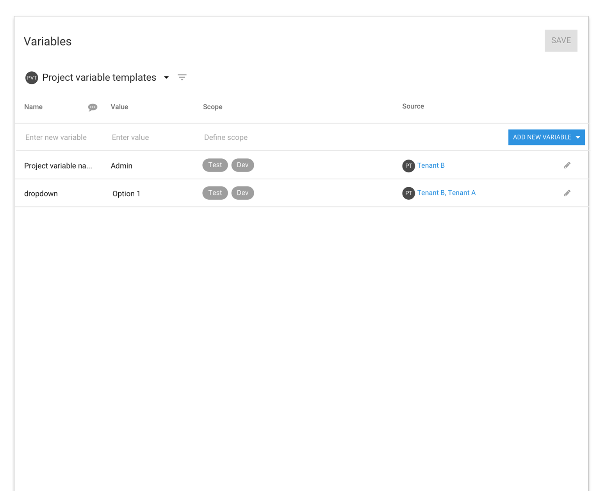
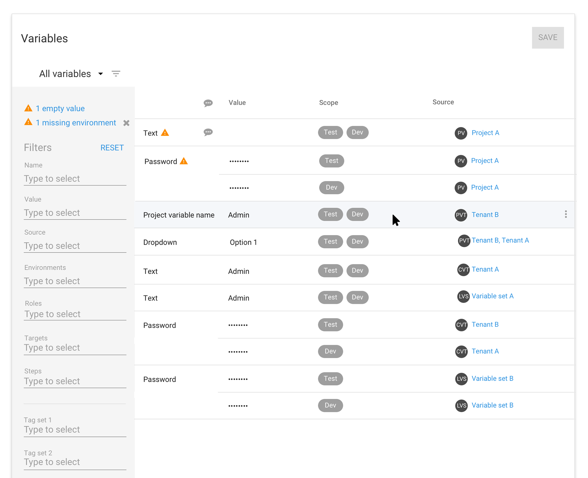
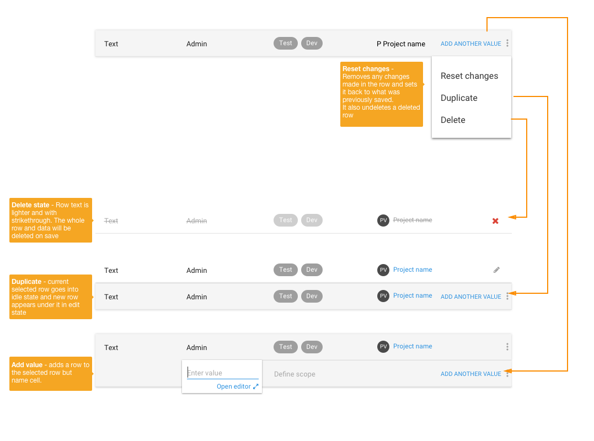

In the 4.0 release, are re-writing the variable editor. This has been one of our top <a href="https://octopusdeploy.uservoice.com/forums/170787-general/suggestions/7192251-improve-variables-ui" target="_blank">User Voice</a> suggestions and thanks to all our users who provided ideas on how to improve the variable editor.

Based on the feedback received our goal for the first release of the variable editor is to make a table editing experience work as expected with the inclusion of some new features:

- Provide multiple values with different scopes to one variable
- Add a description to a variable in the popup editor and hover over the comment icon  in the table to view
- Ability to enter multiple values to a scope when adding a variable.

## User scenarios

We have focused on providing a solution for four user scenarios for the first release. These cover the common themes from the Octopus team and our user's suggestions.

- A user is inputting hundreds of single text variables scoped to one or two environments. They need to do this quickly all by using the keyboard.

- A user has large amounts of code to add as a variable and needs to copy and paste it into a large text field. They have been asked to give each variable a description and scope it to tenant tag sets.

- A user has been given a list of usernames and passwords for each environment. Rather than adding each value one at a time and scoping them individually, the user wants to be able to select the environment first and add multiple values to that environment.


- A user wants to see what values have been scoped to a particular scope configuration to see if there are any duplicates.

**Note** There were some great additional feature suggestions too. But we can’t include them all at once as we want the first release of the variable editor to focus on improving basic usability and create a solid platform for more advanced features.

## The new variable editor look

The variable editor will inherit the new 4.0 UI and maintain high-level concepts like switching between variable types, ability to filter, and view only library variable sets and common templates which are only editable in the Library.

New UI patterns have been introduced to help filter and display information better:

- An advanced filter which is displayed by default and can be hidden by the filter icon 

- Being able to filter by variables with a warning
- Expanding panels so you can now see what variables and common variable templates belong to which variable set
- Source icons help distinguish between the variable types.

**Project variables**

**Project variable templates**

**Common variable templates**

**Library variable sets**

**View all variables**

## Adding a new variable
The current variable editor table has the new variable row at the bottom of the table. Many users have can have lots of entries which causes this empty row to appear off the screen. We have moved the empty add row to the top of the table to make adding a variable quick and easy, no matter how many variables you have. You can click in the name cell to start adding a value or click the “Add new variable button” to create a new row. The video below shows adding new variable.

## Adding multiple values to a scope

We are planning to include the ability to add multiple values to a scope of environments, roles, targets, steps or tenant tag sets. This new function will make it easier to add a set of variables for a new environment or a new role.

This action would appear as a dropdown on the add new variable button as “Add multiple values”. The adding experience will take place in the popup editor with the user defining the scope first then adding multiple values.

## Table editing experience

Our goal for the new variable editor is for it to be a seamless table editing experience for users who input simple variables with minimal scope. We want to make sure a user can navigate the table by keyboard only, with the option to use the mouse.

The following are convention keyboard controls and shortcuts we are planning to use.

### Keyboard control

<dl>
<dt>Tab </dt>
<dd>- Moves the cell focus through the row from left to right, top to bottom
- Moves the selector controls focus from top to bottom</dd>

<dt>Enter</dt>
<dd>- Adds another variable</dd>
<dd>- Performs the action of a selected button</dd>
<dd>- Selects item in dropdown list</dd>

<dt>Arrow up and down </dt>
<dd>- Moves the focus through a dropdown list</dd>
<dd>- Moves the focus from the form field to the Open editor link in the edit dialog</dd>
<dd>- Moves the focus of the rows in the variable table</dd>

<dt>esc</dt>
<dd>- collapses dropdown and puts a cell in selected state</dd>
<dd>- exist edit/add mode if a cell is in a selected state</dd>
<dd>- Esc moves through the states until out of edit mode </dd>

<dt>Typing</dt>
<dd>Will activate any selectors/dropdowns</dd>

<dt>ctl+enter</dt>
<dd>selects multiple items in a drop down</dd>
</dl>

### Shortcuts

<dl>
<dt>ctl+e</dt>
<dd>Opens editor popup</dd>

<dt>ctl+o</dt>
<dd>Creates a new variable</dd>
</dl>

## Row actions

Row actions will appear on hover as an overflow menu at the end of a row. This will replace the current right click function on the first cell.

## The popup editor

The popup editor is used to show advanced options and larger text fields for adding or editing variables. The popup editor can be opened at any time when editing an existing variable. We want to make sure that if a user is only using the keyboard to enter variables that the popup is still accessible via a link and a keyboard shortcut (ctl+o). The same keyboard commands are used to navigate through the popup editor as the table editor.

The advanced settings in popup editor include:

- The ability to add a description to variables
- Larger value text field for adding  code editor
- Prompted value
- Tenant tag sets

## Performance and browser support

As part of 4.0 we want to take full advantage of the progress the Web has made since our last redesign in 2013. This means that Octopus 4.0 will only support Internet Explorer (IE) 11 and up. The 4.0 re-write will also improve the performance, allowing large amounts of data to be loaded and filtered quickly. Please read our GitHub issue for more information on <a href="https://github.com/OctopusDeploy/Issues/issues/3457">Octopus 4.0 browser support</a>.

## Feedback

We think what we have outlined above will improve the way we add variables and provide a better platform for us to add more advanced features to the editor.

We'd love to hear your feedback on the plans for the release of the variable editor. Please have a look for [existing issues](https://github.com/OctopusDeploy/Specs/labels/Variable%20Editor) to comment on, or [raise a new one](https://github.com/OctopusDeploy/Specs/issues/new) with as much detail as you can to get the discussion going.
